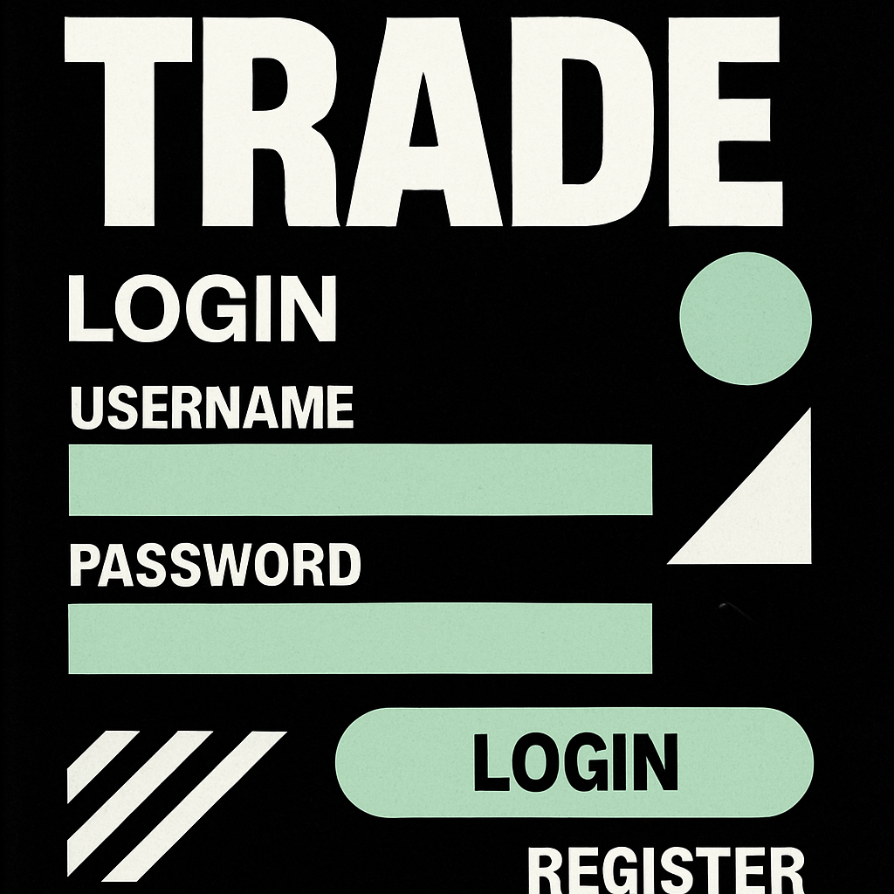
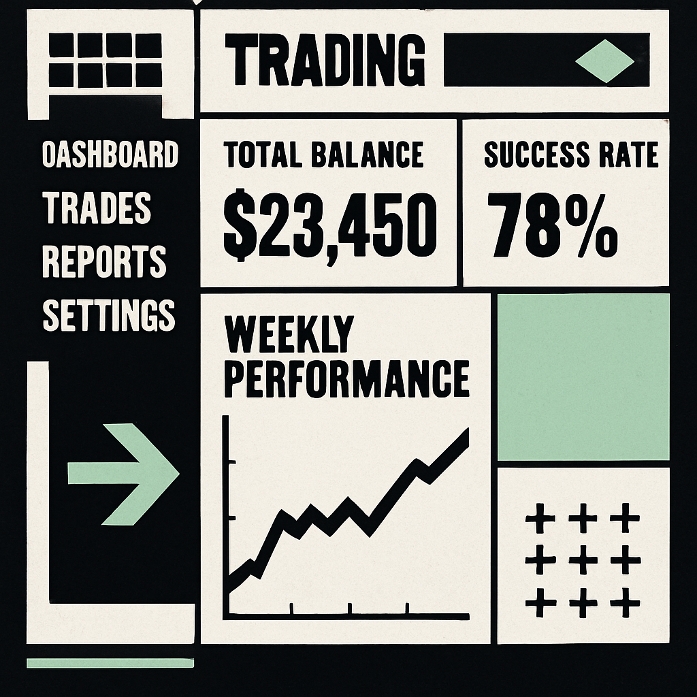
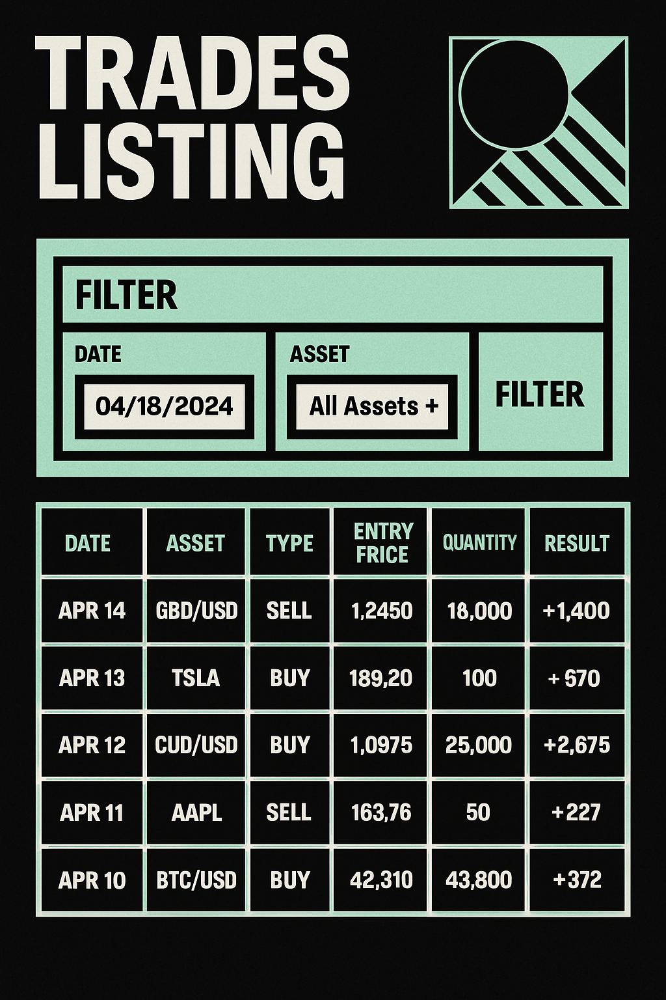

## Mockups do Design Brutalista

### Página de Login

### Dashboard

### Listagem de Trades

## Documentação Técnica

- [Documentação do Redesign Brutalista](./documentacao_tecnica_redesign.md)
- [Integração com CoinGecko](./integracao_coingecko.md)
- [Correção dos Filtros](./correcao_filtros.md)

## Estrutura do Projeto

O projeto segue uma arquitetura modular com:

- `/src/pages` - Páginas principais da aplicação
- `/src/components` - Componentes reutilizáveis organizados por funcionalidade
- `/src/services` - Serviços para comunicação com APIs
- `/src/styles` - Estilos globais e configurações de tema
- `/src/utils` - Utilitários e funções auxiliares
- `/src/hooks` - Hooks personalizados
- `/src/context` - Contextos React
